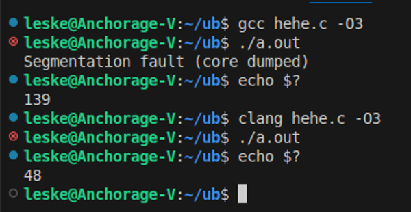
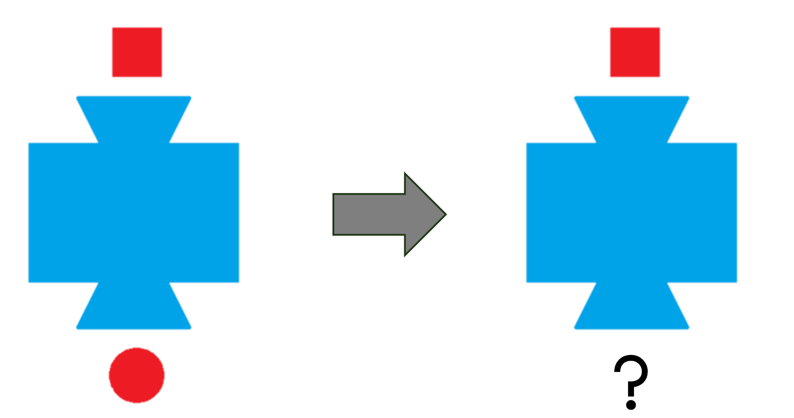
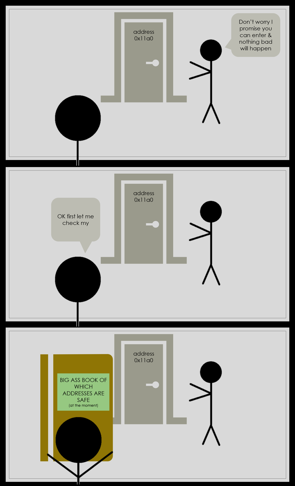
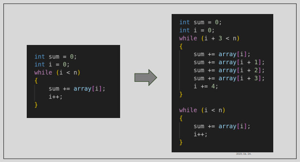
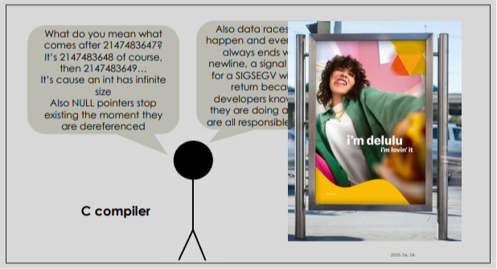
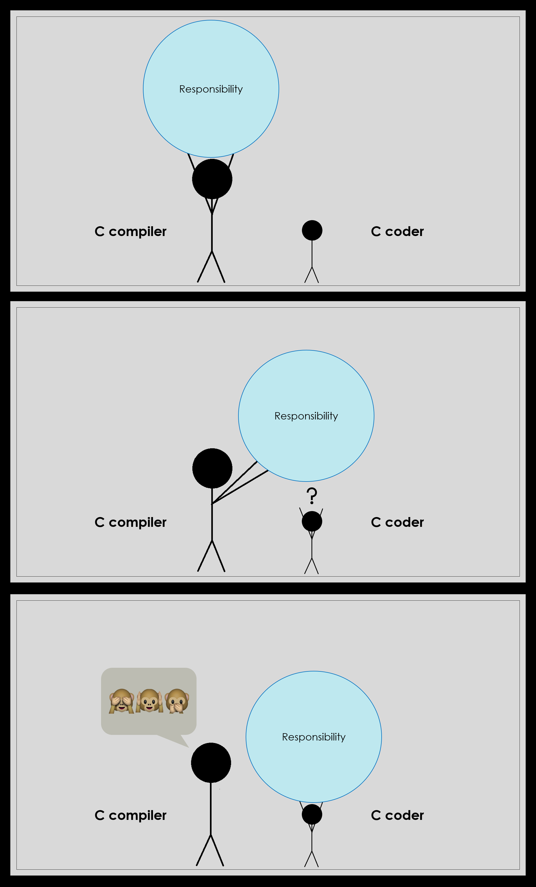

This is a written excerpt of the workshop I did for the 42 Vienna students on the 25th of June, 2025.

You have found very important information. Please read further.

## Why this topic?

This is a topic none of the projects we do at 42 deal with. You can complete all of your Common Core without ever reading up on it (you will likely encounter it in practice, though it will likely remain unnoticed).

This is because the curriculum in 42 in general leaves it up to the individual if they want to look into theory or not. I agree with the sentiment that a lot of theory universities are teaching is redundant, and you will not necessarily need it on the job market. But at the same time I firmly belive **there is some theory one can simply not afford to skip**, and Undefined Behavior is one such topic when it comes to C language (and C++).

Even if most of us will not actually work with C or C++, after 2 years of Common Core, we leave the school claiming we *know* these languages. You can, however, have any hours of coding experience in any of them - there is a bad news for you. If you don't know about Undefined Behavior, **you will simply not know what you are doing** when writing code in these languages. And it's not only that you will not know what you are doing, but what is even worse: you will **think** you know what you are doing, and that makes you very dangerous. Instead of an asset, it makes you a liability.

What I said during my workshop is that instead of C programmers, 42 in this sense actually turns us into weapons. Any one of us could be responsible for next CrowdStrike incident or similar. Therefore we can't afford not to talk about this topic.

My goal with the workshop (and providing this transcript) is for students to have some basic understanding of what UB is, so this can be discussed during evaluations, online on the Slack or Discord, etc. It is the responsibility of all students who listen to or read this to turn this into a discussion and further spread the knowledge.

## Part I - The C Standard

In order to understand the concept of Undefined Behavior, we have to talk about **the C Standard** first.

C language was invented in the 1970s by one guy named Dennis Ritchie. As it became very popular there was the need to standardize it - the first such standard was the ANSI C standard in 1989. Today this is the job of the International Organization for Standardization (ISO) who come up with a new C standard every couple of years.

In my presentation I have provided some excerpts to show how the C standard looks like on the inside. You can also find some versions [on the internet](https://www.open-std.org/jtc1/sc22/wg14/www/docs/n1570.pdf) if you are interested, but it's a very dry document to read.

The thing is, one doesn't need to read the C Standard to be decent at writing C language. YouTube tutorials or other learning specific material is probably better suited for this case.

**Who really needs to know the C Standard to the letter though are the guys who write the C compiler.** Since the compiler is the program which will parse your `.c` files in order to be able to process them, it needs to know **exactly what** counts as valid C syntax and what is not acceptable.

Remember this because it will be very useful in understanding UB later on.

### The concept of "behavior"

The C Standard describes different types of *behavior*. Behavior itself is described as "external appearance or action".

One can understand it like this: there is an action belonging to everything you write in your C code. <br>
For example, if you have declared `int i;` in your code, for the expression `i = 5;` the action is that `i` will get assigned the value `5`. <br>
For the expression `i++;` the action is that `i` will get incremented.

The behavior that belongs to these expressions is clearly defined by the Standard. Some other behaviors are *less clearly* defined, meaning the Standard says, there are possible variations of what might happen on a certain expression (you can find more info on these in my presentation or in my [Footnote #1](#footnote-1-the-less-clearly-defined)). And in other cases, the behavior for a certain expression is *not defined at all*. You might have guessed by now that this is what we call **undefined behavior**.

It is described in the standard as the following:

> behavior, upon use of a nonportable or erroneous program construct or of erroneous data, for which this International Standard **imposes no requirements.**

"Imposes no requirements" here means: you may have these things in your C code, but the C Standard does not specify to what action it should eventually lead to.

For example, if you take our previous code, and add `i /= 0;`, instead of saying this leads to an error (like floating-point exception), the Standard leaves it completely open-ended what will happen.

> Possible undefined behavior ranges from **ignoring the situation
completely with unpredictable results**, to behaving during translation or
program execution in a documented manner characteristic of the
environment (with or without the issuance of a diagnostic message), to
**terminating a translation or execution** (with the issuance of a diagnostic
message).

Any of this might happen, but these are also just examples. The Standard claims we cannot know the consequences.

### Common examples

*What exactly* counts as undefined behavior is surprisingly well-defined in the C Standard. There is a specific list around the end of it, which collects all of the examples for UB mentioned in the previous sections, and this list goes on for about 6 pages.

Some arbitrary examples from this list that you might recognize from your C projects:
- The operand of the unary (see my [Footnote #2](#footnote-2-unary-and-binary)) `*` operator has an invalid value.
    - this could be a null pointer,
    - an inappropriately aligned address,
    - or the address of an object after the end of its lifetime ("use after free" belongs here).
- The value of the second operand of the `/` or `%` operator is zero.
- The program attempts to modify a string literal.
- The program encounters signed integer overflow.
- A nonempty source file does not end in a new-line character (yes that is right)

You can find more examples in my presentation (or even more in the standard itself) if you are interested.

So, the answer to *what is Undefined Behavior?* is quite simple: UB is everything in your code, the behavior of which is either not defined in the standard at all, or is *defined explicitly as undefined.*

## Part II - Is UB the same as Segmentation Fault?

I purposefully began the second part of my presentation with a question that seems very stupid at first glance. I have noticed that UB in the context of 42 curriculum (especially around Libft and the "NULL protection debate") is often discussed as "something in your code that **results in** Segmentation Fault". If you look back at the **common examples** list is just presented, you can indeed notice that if you put these in your code in practice, most of it will likely produce a segfault. But none of us ever got segfault on integer overflow or omitting a newline from the end of a file, so the answer to the question in the title seems quite straightforward.

But I believe this question, when asked by someone, usually has a deeper meaning behind it. And I think the real question being asked here is:

**Can architecture define something that is undefined by the Standard?**

We have seen earlier that the C Standard leaves it open what exactly happens if you dereference `NULL` in your code. But we all know what happens in practice, if we do it. That is because our architecture, which does not let us access the memory address 0, seems to anyway define what happens. Signed integer overflow is another good example for this. The standard might leave it open, but in practice, `INT_MAX` overflows into `INT_MIN`, and it cannot seem to happen any different way on our machines.

So does architecture have the last word in what happens? In order to be able to answer this question, we have to look into a concept called **the abstract machine**.

### The Abstract Machine

Probably all of you have heard by now that C is a **compiled language**. In the first week of Piscine we learned that when we `cc hehe.c` it will get translated to this mysterious file `a.out` that is called the *binary*.

Just like you would parse a config file for `cub3D` for example, the compiler is the program that will open your `.c` file, read its contents, and evenutally create this binary file based on what you want the program to accomplish. This fact has one - very important - consequence: **the code that will actually end up running on your machine is not written by you**. Your C code will never "run", it is just a blueprint that gives the compiler an idea of what to accomplish, but the compiler takes over from there.

The C Standard uses the concept of an **abstract machine** to describe this relationship between your code and the executable. If you think you don't know what an abstract machine is, you are probably wrong about that. Abstract machines are present in a lot of grade school math workbooks. They look like the following:

<div align="center">

</div>
<br>

They are abstract because the inner workings of the machine are not described in detail. We know the *rule:* a square goes in and a circle comes out, but what happens in between, *how* the transformation is achieved doesn't really concern us. We don't know anything about the hardware (cogs? registers? unicorns? a data bus?) but we don't need to care.

Now here is the super important part: your code itself is nothing but a blueprint, a high-level abstraction defining *"I want all squares to be turned into circles."* It is the compiler's job to, based on this, write some code that will then *actually run* and accomplish that.

The Standard describes this saying what the compiler puts into the binary does not really matter as long as the executable's **observable behavior** remains the same as you intended. You can read my [Footnote #3](#footnote-3-observable-behavior) if you want to know what exactly counts as observable behavior, but for a simplified explanation, you can read this excerpt from the Standard:

> 5.1.2.3.6. At program termination, all data written into files shall be
identical to the result that execution of the program according to the
abstract semantics would have produced.

This is one is also called the **as-if rule**. The "abstract semantics" they mention here is your C code, the blueprint the compiler has to follow.

<div align="center">

</div>
<br>

Here I have the picture of a tiny C program I wrote and an optimized intermediate representation of what `gcc` turned it into. You can see that the entire loop is gone, the translation doesn't really resemble our original idea anymore - but what eventually gets printed is the same.

If the compiler wants to, it can follow the square-to-circle process *you* describe in *your* code step-by-step (as closely as the limitations of architecture allow). **But it doesn't have to**. As long as it sees you intended all squares to become circles and it achieves that, it's good to go - even if the two implementations follow very different logic.

### How is this all relevant to UB?

Remember the definition of UB:

> Behavior, upon use of a nonportable or erroneous program construct or
of erroneous data, for which this International Standard **imposes no
requirements**.

When the compiler encounters UB in your code, there is absolutely no requirements as to what it should translate it into. You have probably heard the phrase before that it can write code that "formats your hard drive". While it won't theoretically, it really can. It is **free to do anything**, and is not even required to document it.

The tiny executable I have created for my presentation is a good example: in the C code, we dereference a `NULL` ptr in a loop, and then (in case we somehow survive) return 42. Compiled with `gcc`, our expectations are matched: we get Segmentation Fault. Compiled with `clang` however, nothing observable happens - we can also check that, for some strange reason, our program returned with a value of 48. And the point of UB is, that *this is fine.*

<div align="center">

</div>
<br>

There is a very good summary of this danger in John Regehr's [Guide to Undefined Behavior](https://blog.regehr.org/archives/213):

> C and C++ are **unsafe in a strong sense**: executing an erroneous operation **causes the entire program to be meaningless**, as opposed to just the erroneous operation having an unpredictable result.

As soon as you put UB anywhere in your code, squares don't need to be turned into circles anymore. They can be turned into anything.

<div align="center">

</div>
<br>

And remember that there is a *6 page long* list in the C standard about all the such things you should avoid. Most of them we probably don't even know. So this gives legitimacy of the picture I started my presentation with:

<div align="center">


This image is taken from this very cool [guide](https://pvs-studio.com/en/blog/posts/cpp/1215/) to Undefined Behavior by Dmitry Sviridkin and Andrey Karpov
</div>

## Part III. Why does UB exist?

It is perfectly reasonable to ask why C has this built-in pitfall that obviously makes it very dangerous to use. The Standard is written by humans, after all. Since we have an exact list of what counts as undefined - could we not just go through that list and *define everything?*

Well, the short answer is, yes, we could. At least we could *try*. Some other languages do it. But at the same time, it comes with a price.

Just as thought experiment, let's try to *define* something that the Standard left as undefined. We can take the most commonly mentioned example - dereferencing a NULL pointer. 

Let's put it in the Standard that this will result in an error being shown and the end of execution. You might notice that what we are trying to do here is enforcing what mostly happens *in practice* (Segmentation Fault) also on the *theoretical level* - this is better than giving the compiler a loophole to let it format our hard drive & hoping that a Segfault will be the worst that happens.

So the Standard changed. What now?

Remember from the beginning that **respecting the Standard is not the responsibility of the coder, it is always the responsibility of the compiler.** They can choose to refuse compilation if they can see the coder violated the rules (let's say you forget a semicolon somewhere), but if they choose to compile, they have to ensure the Standard is followed to the letter.

If the compiler sees that you want to do something like:
```
int *ptr = NULL;
*ptr = 42;
```
it can refuse to compile it, you correct your code yourself, and the Standard is happy.

But there is an issue: you might have heard before that the compiler does not know context between different *translation units*. This normally means it processes each of your `.c` files separately. If one of your files has a

```
void function(int *ptr)
{
    *ptr = 42;
}
```
the compiler cannot know if it will *ever* be called from another function, in another file, with a NULL pointer as argument. Maybe it would not even be apparent from your code, because the pointer only gets there somehow during runtime, from, let's say, getting the wrong input or an unprotected malloc failure.

This cannot be caught at compile-time. Still, if the standard says that dereferencing NULL results in an error, the compiler *has to make sure* that it does, even if this only happens at runtime. There is a straightforward solution to this that some of you might have already thought of: the compiler can add a **NULL check** before `*ptr` that results in program termination if met. *And then add NULL checks everywhere else in all of your C code where pointers are being dereferenced.*

Trying to prevent the use of **uninitialized variables** will add similar overhead. We could introduce a new rule that variables should always be initialized on the same line they are declared, otherwise the declaration is invalid. But this would render almost all existing projects that are written in C uncompilable.

The compiler can instead opt to invisibly set all variables to zero upon declaration. This is not a big change and existing code remains functional (unless it relied on UB to begin with). But this means that variables like `int array[1000]` should also be zeroed out (even though the next move of the coder will likely be filling it with something). `malloc` should also behave as `calloc` from now on (even though, again, choosing `malloc` very likely means "I will fill this with something other than zeroes myself"). It's not hard to see that these extra operations all cost execution time.

And there are of course things that are way more difficult to implement than these. You can check my PDF for more examples, but a good example is *trying to prevent double freeing*. Accessing something that has been freed already is UB at the moment. C++ has a few *smart* ways to tackle this issue, but in C, pointers themselves are just addresses without any additional information, which means there is no way to know what exactly lies behind before using `*`. I won't know if it's something I should be able to access or not, and when I get to know it through `*`, it's already too late, because the invalid access has happened.

In order to know this information beforehand, the compiler would have to implement an infrastructure that stores metadata about all of the pointers in your code, and perform a lookup procedure before each access.

<div align="center">

</div>

Letting these things be undefined by the C Standard makes the life of compiler developers easier, keeps the validity of existing C projects, and it also allows for code that works faster.

The latter actually plays a big role in having UB in the Standard, but in a less straightfoward way than one might think from the previous examples. You will see in the next chapter how UB helps achieving *super fast code* by enabling the compiler to **make some assumptions necessary for aggressive optimization**.

### The Weird Way Compilers See the World

Do you remember when we mentioned `INT_MAX` on the hardware level always overflows into `INT_MIN`? Everybody who has done `Rush 00`in Piscine probably has seen this happen with their own eyes too. In the Standard, however, signed integer overflow is listed as undefined: this means the Standard claims that no one quite knows what will happen if we add 1 to `INT_MAX`.

It makes sense in a way, because the Standard talks about an abtract machine we can't know the architecture of. But the main reason behind keeping it undefined is not this, it's much **darker and scarier** than that.

If this sounds interesting, let's inspect what this rule means to the compiler in practice.

One can imagine the Standard as a book of *all possible things* you can encounter in C language. How the compiler uses it can be compared to simplified list like this:
```
if X happens, do A
if Y happens, do B
...
if Z happens, do <anything>
```
You might have guessed that `Z` represents UB in the above list. The compiler needs to watch out for `X`, because it has to translate it `A` way. It also needs to be on the lookout for `Y`, because that will be translated to `B`. But it does not need to watch out for `Z` happening, because the **existence of `Z` is completely irrelevant** to what should be done. **It can pretend as if it's not in the list of possible things at all.**

And this exactly what the compiler will do. It will act exactly as if `Z` can never happen.

I wrote this twice because to me it's the most mind-bending part of how C is processed, but at the same time it's super important to understand. The compiler sees your code through a specific mindset I call **compiler-think**: this says,
> if `Z` is undefined, **assume `Z` is impossible.**

In other words, coming back to our example in the beginning: if integer overflow is impossible, after 2147483647 comes 2147483648 and we can count further until infinity. But no matter the architecture, no computer has registers that are able to count until infinity. So what is the point of this approach?

Only in computing it can happen that `x + 1` ends up being smaller than `x`, this would be impossible in math. Making the compiler be aware of this would mean we are not allowing it to have any assumptions about the result of arithmetic operations - but assumptions (like the one that `x + 1` will be bigger than `x`) are necessary to perform optimizations, like simplification of an expression.

Not that this assumption has the side effect that calling a function like this:

```
bool detect_overflow(int x)
{
    int y = x + 1;
    return (y < x);
}
```
can be collapsed into `false` (and thus lose its purpose) with optimizations enabled.

Another instance at optimization where doing "pure math" instead of the CS version comes in handy is **loop unrolling**. This technique is super common and one of the most powerful tools of the compiler when it comes to actual execution time spared.

If you have a loop that does 1 operation for `n` iterations, it can be transformed into another that does, let's say, 4 operations for `n / 4` iterations instead (you for sure need to do the leftover separately ). I made a very simple illustration of this in my presentation:

<div align="center">

</div>

<br>See my [Footnote #4](#footnote-4-heat-control) if you want to better understand why things like this make your code more effective.

Now let's say we are dealing with a loop like this:

```
while (y <= max_y)
{
    //do some stuff here
    y++;
}
```

Those of you who did `Rush 00` know what is possibly wrong with this loop. If we don't quite know what `max_y` is, we might deal with an infinite loop here (in case `max_y` is 2147483647 and `y` overflows). But it doesn't make sense to unroll a loop that's infinite - the effect of such "optimization" in practice is zero, so all the effort spent on it is net loss.

If overflow is *impossible* however, then we don't have to deal with doubts like this.

But it's not only integer overflow we are talking about here. This way of thinking applies to all UB, for example, the compiler will also assume that **dereferencing a NULL pointer is impossible**. In practice this means that in case it seems `*ptr` or `ptr[i]` anywhere in your code, it can work with the assumption that `ptr` is *not* NULL.

Doesn't seem scary yet? Well I will tell you another assumption compilers like to work with: *all functions will return*. There are only a very few set of specific functions (like `abort` or `exit`) where it knows this is not the case. Combine these two assumptions and you get code like:
```
char *result = malloc(result_size);
if (!result)
    ft_exit(data_to_free);
result[0] = '\0';
```
optimized into
```
char *result = malloc(result_size);
result[0] = '\0';
```
If `ft_exit` is assumed to return (and it also clearly doesn't modify `result`), dereferencing `result` will happen on all possible branches of execution. That means it *cannot* be a NULL pointer, that means the `if` condition will always be false, so the `if` check can be removed completely.

I know it looks hard to process at first, and honestly speaking, it made me lose a lot of trust in C language. I find the situation super scary. As a coder, you *rely* on the compiler. You have no other way to get your code to the CPU but through the compiler. But the compiler behaves like a very delusional madman. Or rather, it behaves perfectly rational in the constrains of its own weird world and the rules of compiler-think. But most developers are not aware of compiler-think at all. And if the developer and compiler don't speak the same language, then sooner or later, but definitely surely, weird shit will happen.

<div align="center">

</div>

### Historical burden

Finally, there is one more reason for why we have UB in C language, and it's way less exciting than the previous ones (but not in any way less important). By the time the C standardization began, the language was already widely in use (this is also true for C++ for the matter). There were already C compilers in use, and they already behaved a specific way, and the people who had to come up with the Standard could not declare practices that were already widely in use "illegitimate".

Other languages have been designed with memory-safety in mind, a lot of the times inspired by a willingness to learn from C's mistakes. It is much easier to build something like that from the ground up, than to change a language's inner workings when they are already foundational part of big projects.

By the time of writing the first C standard, different compilers were already in standard use.
- Certain important projects were written assuming specific compiler behavior
- Forcing them to change compiler would have required serious refactoring
- Instead, the standard incorporated already existing behaviors
- If different compilers handled a case differently → rather left UB

### So: can architecture *define* the undefined?

//would be nice to write here about the tradeoff - as long as you write flawless code, the compiler can very efficiently work together with you to optimize it, and you will end up with a very fast executable. But as soon as you make mistakes, the compiler ends up working *against you* instead of with you.
The compiler basically thinks of you as a professional who knows what they are doing. The issue is, there is no single man on earth who never makes mistakes.

<div align="center">

</div>

## Part IV. UB @ 42

In my presentation I have provided a non-comprehensive list of how to fight UB that can occur in your 42 projects. 

The most important of these is to **spread awareness of UB on campus**. Make it a topic during coding and evaluations. I find it a big mistake that we mostly code in C and C++ and this topic is barely discussed or known about despite its obvious importance.

A good way to check if your code has UB is to **compile it with optimization flags**. This is because a lot of hidden pitfalls of UB are only taken advantage of by the compiler when aggressive optimizations are enabled. This is not a foolproof way to catch issues, but one thing is for sure: a code that has no UB has to work the same compiled with `-O3` as without.

Static code analyzers like `scan-build` are also able to detect more obvious cases that might be visible at compile-time. For runtime checking, you can use the `-fsanitize=undefined` flag at compilation and let UBSan look for issues. This will report any UB it encounters at runtime, but just like before, not seeing errors does not automatically mean your code is free from issues. There could be a problem in your code that is only triggered in some very specific cases. It also won't notice any UB that might already be replaced with weird things by the compiler.

Another thing that has been a discussion on my campus is how UB should be treated *in practice* during an evaluation. There is an infamous recurring line in 42 subjects that some of you probably know:
> Your functions should not quit unexpectedly (segmentation fault, bus error, double free, etc.) **except for undefined behavior**.

A common understanding of this line (at least on my campus) is that NULL checks placed in `Libft` functions are not necessary (the function should have an option to segfault if it receives a NULL pointer).

Since Moulinette does not let us use assertions and the other option would be to silence the error happening (by simply returning from the function), I also share this opinion. This **does not mean however**, that if any such function used later in a bigger project (like cube) actually *does* receive a NULL (either because of a missing malloc protection or other mistake) and segfaults, that the project is still passable. Even thoguh, very strictly speaking, cube eventually died because of UB that happened at runtime, and one could understand the subject as allowing this.

At the same time, I really do not know what kind of segfault or double free the subject is thinking of that *does not come from* undefined behavior.

## Useful links for further reading

This is the end of UB guide. Thanks for reading so far and hopefully you could find some knowledge you can take with yourself for the future. For me, learning about the way the compiler think when it processes our files completely changed how I look at C language.

Here are some sources for further reading (with a lot more practical examples that I have provided) that might also be interesting for you:
- [LLVM Project Blog – What every C programmer should know about Undefined Behavior](https://blog.llvm.org/2011/05/what-every-c-programmer-should-know.html) (by Chris Lattner)
- [A Guide to Undefined Behavior in C and C++](https://blog.regehr.org/archives/213) (by John Regehr)
- [C++ programmer's guide to Undefined Behavior](https://pvs-studio.com/en/blog/posts/cpp/1215/) (by Dmitry Sviridkin and Andrey Karpov)
- [Examples for Undefined Behavior on cppreference](https://en.cppreference.com/w/c/language/behavior.html)

## Footnotes

### Footnote 1. The Less Clearly Defined

There is a lot of "grey areas" in the Standard between clearly defined and undefined behavior. I didn't want to list them in the main text, as this is not the main point of this guide, but I will provide a quick overview here.

The first of such is **unspecified behavior** (often confused with undefined behavior). Here the Standard

> provides two or more possibilities and imposes no further requirements on which is chosen in any Instance.

An example of unspecified behavior is the order in which the arguments to a function are
evaluated. For example, from the code `write(1, string(), len());` alone, it is impossible to tell whenever `string()` function (this returns a `char *`) or `len()` function (this returns an `int`) will be called first.

**Implementation-defined behavior** is a stricter subgroup of unspecified behavior. The defintion of this is the following:

> Unspecified behavior, where each implementation **documents** how the choice is made.

What makes this stricter is the need for documentation. For example, there are different ways a computer can perform right bitshift, but only one operator for the same (`>>`) in C. Since the different approaches behave a little bit differently (regarding the preservation of the sign bit for example), the compiler needs to make a choice about which one to use. Different compilers might decide to implement different methods of bitshifting, but they need to document their choice in each case.

**Locale-specific behavior** is then a subgroup of implementation-defined behavior, described as the following:

> Behavior that depends on local conventions of nationality, culture, and language that each
implementation documents. An example of locale-specific behavior is whether the `islower` function returns true for characters other than the 26 lowercase Latin letters.

Again, no matter the behavior of choice, it needs to be properly documented.

### Footnote 2. Unary and Binary

I added this Footnote because I mentioned the "unary `*` operator" - which is a quote from the Standard, but it feels weird to use it without further explanation.

Making sense of the term is quite straightforward once you know the rule of terminology:

- **binary** operators work with two operands (values or variables) to perfrom an operation.
    - for example, the binary `+` can be used like `i + j` - it adds to values.
- **unary** operators perform operations on a single operand.
    - for example, the unary `+` can be used to do `++i` - to increment a single value.

Based on this you can probably guess that "binary `*`" perfoms multiplication (`i * j`), and "unary `*`" is the dereference operator (`*i`). The standard describes this in a fancy way: it says the unary `*` operator *denotes indirection*.


### Footnote 3. Observable Behavior

What counts as "observable behavior" is a bit more complex than how I presented above. For the most part, it is indeed about files your program will modify (be that the terminal or a text file or anything else), because this is something you can observe from the outside.

But all reads and writes to `volatile` objects also count as observable.

What are `volatile` objects?

- "Object" here means anything, even a `char` or an `int`, not necessarily in a "C++ object" sense.
- `volatile` is a keyword in C and C++ like `const`. Just like you could have an `int` or a `const int`, you can also have a `volatile int` and so on.

In practice, `volatile` means the value of this object can be changed at any time *by an external source*, unrelated to what is happening in your code. In practice this is mostly needed in embedded sytems - let's say a certain memory location connects you with another device that communicates you by writing there. You keep reading it and each time you read it, something else is written there, even though none of that is done by *you* from *your code*. `volatile` is your way of letting the compiler know this will happen, so it will never consider to remove or reorganize these reads for convenience.

This is important from the aspect of optimizations because if you have a loop like this:
```
int i = 0;
while (i < 1000)
    i++;
```
The compiler is free to turn that into
```
int i = 1000;
```
On the other hand, if you change it to
```
volatile int i = 0;
while (i < 1000)
    i++;
```
the loop has to be left completely intact. Imagine there is an external device that also has access to `i` and modifies it at the same time you do. Any time you check it in the while loop, its value might be 1, 2101, or 2147483647, anything that fits into `int` range. Therefore you cannot, at any point have assumptions about the value of it, including the assumption that it will be set to a 1000 when the loop is done.

While often used simply to prevent optimizations done to specific parts of the code, accesses to `volatile` objects count as observable because another outside source is supposedly communicating with your program through this means.

### Footnote 4. Heat Control

This footnote is about what makes an optimization effective.

Optimizations are modifications done to an already existing code, without changing what it achieves, in order to save resources. The resource is mostly time (as in the goal is faster/smoother execution), but it could be computational power, memory usage, even the size of the executable. You can optimize for a lot of different factors, this will always be unique to your specific purpose and environment. In the following text I will talk about *optimization for execution time*.

Optimization *itself* takes time and effort. A good optimization is therefore an investment, and a good optimizer makes sure the time invested in optimization will be worth it on the long run.

For effective optimization, one needs to find those parts of the code where the effect of such a refactor is most measurable. To be able to determine which are these parts of your code, I have come up with the concept of **heat control**.

Let's assume, for the sake of this thought experiment, that your code is executed "as-is". All of your lines of code start with an imaginary 0°C of heat associated. Each time the processor visits one line, it gains 1°C of heat. At the end of execution, you will get a **heatmap** of your code.
 - Some lines like `handle_error();` may remain frozen.
 - Some, like `write(1, "Welcome to my nice program\n", 27);` may only heat up to 1°C.
 - Some others like `while (i < 16378192)` become 16378192 degrees hot.

Now heat is not necessarily bad and it's also not necessarily avoidable. But having a heatmap of your code gives you a good idea which parts optimization should focus on. First and foremost you want to focus on the parts that are **super hot**. You can try to aim for a more optimal heat distribution, and also to divert heat away from parts of your code that are *expensive to execute*.

**Loop unrolling**, like shown above, is a good example for the former. Conditions of loops can get super hot, so that will likely make optimization that focuses on them quite effective. In this case, your total heat will end up being reduced as well. An example for the latter is trying to reduce the amount of system calls made. System calls (like `read` or `write`) are super expensive operations. Check the following two implementations of `ft_putstr` to get a good idea of the difference:

```
//version A
void ft_putstr(char *str)
{
    while (*str)
    {
        write(1, str, 1);
        str++;
    }
}

//version B
void ft_putstr(char *str)
{
    write(1, str, ft_strlen(str));
}
```
We don't get *less heat* for version 2, because we will still need to iterate through every character of `str`, but that heat is now diverted to the loop of `strlen`, and `write` is only called once. Remember that a call to `write` is super expensive, and the string might be quite long for what we know.


## TLDR for the lazy

In this last section I will provide a quick summary to those who don't feel like reading through this guide (although I can promise it's really worth it). It's still better to walk away with some information than no information at all, so I will try to summarize the most important points.

- The C code you write will never "run" on your machine. The compiler that translates it into a binary file (like `a.out`) writes the actual program that gets executed.
- It is also free to rewrite your logic as long as the results are the same as you intended.
- The compiler only has one rulebook: the C Standard. The Standard decides what your code “means” and how it should be interpreted when creating the real program.
- Most of the time this rulebook is clear. `int i = 5;` for example has a quite simple meaning.
- But for some things that can happen in your code (like signed integer overflow), the rulebook has no rule as to what it should be turned into (you can still read the full version if you wonder why `INT_MAX + 1` won't give you `INT_MIN`).
- This is called Undefined Behavior (UB), and because the Standard specifies no rules, the compiler is free to do anything.
- This means that having a single instance of UB anywhere in your code **makes your entire program meaningless**. It might crash, print nonsense, but the scary part is that quite often it just appears to work (for the time being), but you can’t trust it anymore.
- A different compiler or a different optimization level might create **something entirely different from the same code** if it has UB in it.
- UB is actually super common. You probably have it in at least one of your 42 projects, but quite possibly more.

Please go back and read the full guide if this sounds scary enough.

May the gods of cursed C code have mercy on our soul.

