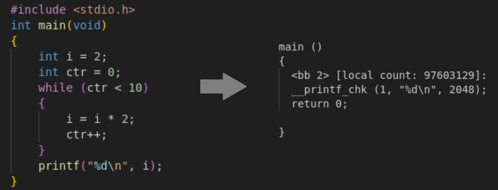
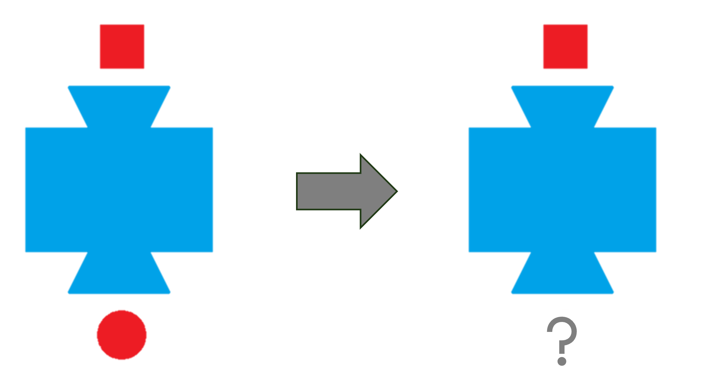

This is a written excerpt of the workshop I did for the 42 Vienna students on the 25th of June, 2025.

You have found very important information. Please read further.

## Why this topic?

This is a topic none of the projects we do at 42 deal with. You can complete all of your Common Core without ever reading up on it (you will likely encounter it in practice, though it will likely remain unnoticed).

This is because the curriculum in 42 in general leaves it up to the individual if they want to look into theory or not. I agree with the sentiment that a lot of theory universities are teaching is redundant, and you will not necessarily need it on the job market. But at the same time I firmly belive **there is some theory one can simply not afford to skip**, and Undefined Behavior is one such topic when it comes to C language (and C++).

Even if most of us will not actually work with C or C++, after 2 years of Common Core, we leave the school claiming we *know* these languages. You can, however, have any hours of coding experience in any of them - there is a bad news for you. If you don't know about Undefined Behavior, **you will simply not know what you are doing** when writing code in these languages. And it's not only that you will not know what you are doing, but what is even worse: you will **think** you know what you are doing, and that makes you very dangerous. Instead of an asset, it makes you a liability.

What I said during my workshop is that instead of C programmers, 42 in this sense actually turns us into weapons. Any one of us could be responsible for next CrowdStrike incident or similar. Therefore we can't afford not to talk about this topic.

My goal with the workshop (and providing this transcript) is for students to have some basic understanding of what UB is, so this can be discussed during evaluations, online on the Slack or Discord, etc. It is the responsibility of all students who listen to or read this to turn this into a discussion and further spread the knowledge.

## Part I - The C Standard

In order to understand the concept of Undefined Behavior, we have to talk about **the C Standard** first.

C language was invented in the 1970s by one guy named Dennis Ritchie. As it became very popular there was the need to standardize it - the first such standard was the ANSI C standard in 1989. Today this is the job of the International Organization for Standardization (ISO) who come up with a new C standard every couple of years.

In my presentation I have provided some excerpts to show how the C standard looks like on the inside. You can also find some versions on the internet (LINK) if you are interested, but it's a very dry document to read.

The thing is, one doesn't need to read the C Standard to be decent at writing C language. YouTube tutorials or other learning specific material is probably better suited for this case.

**Who really needs to know the C Standard to the letter though are the guys who write the C compiler.** Since the compiler is the program which will parse your `.c` files in order to be able to process them, it needs to know **exactly what** counts as valid C syntax and what is not acceptable.

Remember this because it will be very useful in understanding UB later on.

### The concept of "behavior"

The C Standard describes different types of *behavior*. Behavior itself is described as "external appearance or action".

One can understand it like this: there is an action belonging to everything you write in your C code. <br>
For example, if you have declared `int i;` in your code, for the expression `i = 5;` the action is that `i` will get assigned the value `5`. <br>
For the expression `i++;` the action is that `i` will get incremented.

The behavior that belongs to these expressions is clearly defined by the Standard. Some other behaviors are *less clearly* defined, meaning the Standard says, there are possible variations of what might happen on a certain expression (you can find more info on these in my presentation or in my [Footnote #1](#footnote-1-the-less-clearly-defined)). And in other cases, the behavior for a certain expression is *not defined at all*. You might have guessed by now that this is what we call **undefined behavior**.

It is described in the standard as the following:

> behavior, upon use of a nonportable or erroneous program construct or of erroneous data, for which this International Standard **imposes no requirements.**

"Imposes no requirements" here means: you may have these things in your C code, but the C Standard does not specify to what action it should eventually lead to.

For example, if you take our previous code, and add `i /= 0;`, instead of saying this leads to an error (like floating-point exception), the Standard leaves it completely open-ended what will happen.

> Possible undefined behavior ranges from **ignoring the situation
completely with unpredictable results**, to behaving during translation or
program execution in a documented manner characteristic of the
environment (with or without the issuance of a diagnostic message), to
**terminating a translation or execution** (with the issuance of a diagnostic
message).

Any of this might happen, but these are also just examples. The Standard claims we cannot know the consequences.

### Common examples

*What exactly* counts as undefined behavior is surprisingly well-defined in the C Standard. There is a specific list around the end of it, which collects all of the examples for UB mentioned in the previous sections, and this list goes on for about 6 pages.

Some arbitrary examples from this list that you might recognize from your C projects:
- The operand of the unary `*` operator has an invalid value.
    - this could be a null pointer,
    - an inappropriately aligned address,
    - or the address of an object after the end of its lifetime ("use after free" belongs here).
- The value of the second operand of the `/` or `%` operator is zero.
- The program attempts to modify a string literal.
- The program encounters signed integer overflow.
- A nonempty source file does not end in a new-line character (yes that is right)

You can find more examples in my presentation (or even more in the standard itself) if you are interested.

So, the answer to *what is Undefined Behavior?* is quite simple: UB is everything in your code, the behavior of which is either not defined in the standard at all, or is *defined explicitly as undefined.*

## Part II - Is UB the same as Segmentation Fault?

I purposefully began the second part of my presentation with a question that seems very stupid at first glance. I have noticed that UB in the context of 42 curriculum (especially around Libft and the "NULL protection debate") is often discussed as "something in your code that **results in** Segmentation Fault". If you look back at the **common examples** list is just presented, you can indeed notice that if you put these in your code in practice, most of it will likely produce a segfault. But none of us ever got segfault on integer overflow or omitting a newline from the end of a file, so the answer to the question in the title seems quite straightforward.

But I believe this question, when asked by someone, usually has a deeper meaning behind it. And I think the real question being asked here is:

**Can architecture define something that is undefined by the Standard?**

We have seen earlier that the C Standard leaves it open what exactly happens if you dereference `NULL` in your code. But we all know what happens in practice, if we do it. That is because our architecture, which does not let us access the memory address 0, seems to anyway define what happens. Signed integer overflow is another good example for this. The standard might leave it open, but in practice, `INT_MAX` overflows into `INT_MIN`, and it cannot seem to happen any different way on our machines.

So does architecture have the last word in what happens? In order to be able to answer this question, we have to look into a concept called **the abstract machine**.

### The Abstract Machine

Probably all of you have heard by now that C is a **compiled language**. In the first week of Piscine we learned that when we `cc hehe.c` it will get translated to this mysterious file `a.out` that is called the *binary*.

Just like you would parse a config file for `cub3D` for example, the compiler is the program that will open your `.c` file, read its contents, and evenutally create this binary file based on what you want the program to accomplish. This fact has one - very important - consequence: **the code that will actually end up running on your machine is not written by you**. Your C code will never "run", it is just a blueprint that gives the compiler an idea of what to accomplish, but the compiler takes over from there.

The C Standard uses the concept of an **abstract machine** to describe this relationship between your code and the executable. If you think you don't know what an abstract machine is, you are probably wrong about that. Abstract machines are present in a lot of grade school math workbooks. They look like the following:

<div align="center">

</div>
<br>

They are abstract because the inner workings of the machine are not described in detail. We know the *rule:* a square goes in and a circle comes out, but what happens in between, *how* the transformation is achieved doesn't really concern us. We don't know anything about the hardware (cogs? registers? unicorns? a data bus?) but we don't need to care.

Now here is the super important part: your code itself is nothing but a blueprint, a high-level abstraction defining *"I want all squares to be turned into circles."* It is the compiler's job to, based on this, write some code that will then *actually run* and accomplish that.

The Standard describes this saying what the compiler puts into the binary does not really matter as long as the executable's **observable behavior** remains the same as you intended. You can read my Footnote #2 if you want to know what exactly counts as observable behavior, but for a simplified explanation, you can read this excerpt from the Standard:

> 5.1.2.3.6. At program termination, all data written into files shall be
identical to the result that execution of the program according to the
abstract semantics would have produced.

The "abstract semantics" they mention here is your C code, the blueprint the compiler has to follow.

<div align="center">

</div>
<br>

Here I have the picture of a tiny C program I wrote and an optimized intermediate representation of what `gcc` turned it into. You can see that the entire loop is gone, the translation doesn't really resemble our original idea anymore - but what eventually gets printed is the same.

If the compiler wants to, it can follow the square-to-circle process *you* describe in *your* code step-by-step (as closely as the limitations of architecture allow). **But it doesn't have to**. As long as it sees you intended all squares to become circles and it achieves that, it's good to go - even if the two implementations follow very different logic.

### How is this all relevant to UB?

Remember the definition of UB:

> Behavior, upon use of a nonportable or erroneous program construct or
of erroneous data, for which this International Standard **imposes no
requirements**.

When the compiler encounters UB in your code, there is absolutely no requirements as to what it should translate it into. You have probably heard the phrase before that it can write code that "formats your hard drive". While it won't theoretically, it really can. It is **free to do anything**, and is not even required to document it.

The tiny executable I have created for my presentation is a good example: in the C code, we dereference a `NULL` ptr in a loop, and then (in case we somehow survive) return 42. Compiled with `gcc`, our expectations are matched: we get Segmentation Fault. Compiled with `clang` however, nothing observable happens - we can also check that, for some strange reason, our program returned with a value of 48. And the point of UB is, that *this is fine.*

<div align="center">

</div>
<br>

There is a very good summary of this danger in John Regehr's [Guide to Undefined Behavior](https://blog.regehr.org/archives/213):

> C and C++ are **unsafe in a strong sense**: executing an erroneous operation **causes the entire program to be meaningless**, as opposed to just the erroneous operation having an unpredictable result.

As soon as you put UB anywhere in your code, squares don't need to be turned into circles anymore. They can be turned into anything.

<div align="center">

</div>
<br>

And remember that there is a *6 page long* list in the C standard about all the such things you should avoid. Most of them we probably don't even know. So this gives legitimacy of the picture I started my presentation with:

<div align="center">


This image is taken from this very cool [guide](https://pvs-studio.com/en/blog/posts/cpp/1215/) to Undefined Behavior by Dmitry Sviridkin and Andrey Karpov
</div>

## Part III. Why does UB exist?

It is perfectly reasonable to ask why C has this built-in pitfall that obviously makes it very dangerous to use. The Standard is written by humans, after all. Since we have an exact list of what counts as undefined - could we not just go through that list and *define everything?*

Well, the short answer is, yes, we could. Some other languages do that. But at the same time, it comes with a price.

Just as thought experiment, let's try to *define* something that the Standard left as undefined. We can take the most commonly mentioned example - dereferencing a NULL pointer. Let's put it in the Standard that this will result in an error being shown and the end of execution. Better than letting the compiler format our hard drive at least.

Remember from the beginning that **respecting the Standard is not the responsibility of the coder, it is always the responsibility of the compiler.** They can choose to refuse compilation if they can see the coder violated the rules (let's say you forget a semicolon somewhere), but if they choose to compile, they have to ensure the Standard is followed to the letter.

The compiler, however, cannot know if some function like the one below will *ever* receive a NULL pointer.

```
void function(int *ptr)
{
    *ptr = 42;
}
```

This cannot be caught at compile-time. Still, if the standard says that dereferencing NULL results in an error, the compiler *has to make sure* that it does, even if this only happens at runtime. There is a straightforward solution to this that some of you might have already thought of: the compiler can add a NULL check before `*ptr`. *And then add NULL checks everywhere else in all of your C code where pointers are being dereferenced.*

There are of course things that are way more difficult to implement than this. You can check the PDF for more examples, but a good example is *trying to prevent double freeing*. Accessing something that has been freed at the moment counts as UB. Pointers themselves are just addresses though, and right now there is no way in C language to know what exactly lies behind (something I should be able to access or not) before dereferencing itself happens (and by then it's too late). In order to know this information beforehand, the compiler would have to implement a whole infrastructure that stores metadata about all of the pointers in your code, and perform a lookup procedure before each access.

<div align="center">
<picture>
   <source media="(min-width: 769px)" srcset="./img/img5_mb.png">
   <source media="(max-width: 768px)" srcset="./img/img5_mb.png">
   
</picture>
</div>
<br>

Letting these things be undefined by the C Standard makes the job of compiler developers easier and more straightforward. It also allows for faster code (all of the additional NULL-checks and lookups we mentioned earlier take up time). In fact, the strongest reason for keeping UB is that it makes C to be a very fast language (but not like my example) - by enabling the compiler to **make some assumptions necessary for aggressive optimization**.

### Compiler Optimizations

Do you remember when we mentioned `INT_MAX` on the hardware level always overflows into `INT_MIN`? Everybody who has done `Rush 00`in Piscine probably has seen this happen with their own eyes too. In the Standard, however, signed integer overflow is listed as undefined: this means the Standard claims that no one quite knows what will happen if we add 1 to `INT_MAX`.

And the reason for this is not that it might happen different on another architecture. The reason, and this might sound weird, is to let the compiler think: *signed integer overflow is impossible*. In other words, after 2147483647 comes 2147483648 and we can count further until infinity.

No matter the architecture, no computer has registers that are able to count until infinity. So what is the point of this approach?

In order to be able to optimize your code effectively, the compiler adopts the following mindset: "if it isn't defined what will happen on x, **I will assume that x will never happen**."

Logically this is sound. In care you are wrong and thing you assumed is impossible happens - whatever the result, you are good (since everything is allowed by the Standard). I will also show you why this mindset is super powerful in practice.

One super common optimization technique the compiler uses to make your code faster is *loop unrolling*. If you have a loop that does 1 operation for N iterations, the compiler transforms it into another that does, let's say, 4 operations for N/4 iterations instead (you for sure need to do the leftover separately ).

```
while (i <= N)
{
    arr[i] += val;
    i++;
}
```

Those of you who did `Rush 00` know what is possibly wrong with this loop. If we don't quite know what `N` is, we might deal with an infinite loop here (in case `N` is 2147483647 and `i` overflows). But it only makes sense to unroll a loop that isn't infinite. If we could know *for sure* this loop won't overflow, we could turn it into something like

```
while (i + 3 <= N)
{
    arr[i] += val;
    arr[i + 1] += val;
    arr[i + 2] += val;
    arr[i + 3] += val;
    i += 4;
}
while (i <= N)
{
    arr[i] += val;
    i++;
}
```

<small>See my footnote 5 for why this makes your program faster.</small>

And well, if signed int is impossible to overflow, we achieve just that. So, for this purpose, yes, the compiler will assume that 2147483648 comes after 2147483647, we can count like this till infinity and beyond.

### Historical reasons

Finally, there is one more reason for why we have UB in C language, and it's way less exciting than the previous ones (but not in any way less important). By the time the C standardization began, the language was already widely in use (this is also true for C++ for the matter). There were already C compilers in use, and they already behaved a specific way, and the people who had to come up with the Standard could not declare practices that were already widely in use "illegitimate".

Other languages have been designed with memory-safety in mind, a lot of the times inspired by a willingness to learn from C's mistakes. It is much easier to build something like that from the ground up, than to change a language's inner workings when they are already foundational part of big projects.

By the time of writing the first C standard, different compilers were already in standard use.
- Certain important projects were written assuming specific compiler behavior
- Forcing them to change compiler would have required serious refactoring
- Instead, the standard incorporated already existing behaviors
- If different compilers handled a case differently → rather left UB

### Final thoughts

//would be nice to write here about the tradeoff - as long as you write flawless code, the compiler can very efficiently work together with you to optimize it, and you will end up with a very fast executable. But as soon as you make mistakes, the compiler ends up working *against you* instead of with you.
The compiler basically thinks of you as a professional who knows what they are doing. The issue is, there is no single man on earth who never makes mistakes.

<div align="center">
<picture>
   <source media="(min-width: 769px)" srcset="./img/img6_mb.png">
   <source media="(max-width: 768px)" srcset="./img/img6_mb.png">
   
</picture>
</div>
<br>

## Part IV. UB @ 42

In my presentation I have provided a non-comprehensive list of how to fight UB that can occur in your 42 projects. 

The most important of these is to **spread awareness of UB on campus**. Make it a topic during coding and evaluations. I find it a big mistake that we mostly code in C and C++ and this topic is barely discussed or known about despite its obvious importance.

A good way to check if your code has UB is to **compile it with optimization flags**. This is because a lot of hidden pitfalls of UB are only taken advantage of by the compiler when aggressive optimizations are enabled. This is not a foolproof way to catch issues, but one thing is for sure: a code that has no UB has to work the same compiled with `-O3` as without.

Static code analyzers like `scan-build` are also able to detect more obvious cases that might be visible at compile-time. For runtime checking, you can use the `-fsanitize=undefined` flag at compilation and let UBSan look for issues. This will report any UB it encounters at runtime, but just like before, not seeing errors does not automatically mean your code is free from issues. There could be a problem in your code that is only triggered in some very specific cases, or already removed by the compiler during optimization. //would have to explain why is is an issue... holy hell this topic is hard

//discussion about 42 subjects

## Useful links for further reading

This is the end of UB guide. Thanks for reading so far and hopefully you could find some knowledge you can take with yourself for the future. For me, learning about the way the compiler think when it processes our files completely changed how I look at C language.

Here are some sources I have read on this topic before my presentation that might also be interesting for you:
- [LLVM Project Blog – What every C programmer should know about Undefined Behavior](https://blog.llvm.org/2011/05/what-every-c-programmer-should-know.html) (by Chris Lattner)
- [A Guide to Undefined Behavior in C and C++](https://blog.regehr.org/archives/213) (by John Regehr)
- [C++ programmer's guide to Undefined Behavior](https://pvs-studio.com/en/blog/posts/cpp/1215/) (by Dmitry Sviridkin and Andrey Karpov)

## Footnotes

### Footnote 1. The Less Clearly Defined

There is a lot of "grey areas" in the Standard between clearly defined and undefined behavior. I didn't want to list them in the main text, as this is not the main point of this guide, but I will provide a quick overview here.

The first of such is **unspecified behavior** (often confused with undefined behavior). Here the Standard

> provides two or more possibilities and imposes no further requirements on which is chosen in any Instance.

An example of unspecified behavior is the order in which the arguments to a function are
evaluated. For example, from the code `write(1, string(), len());` alone, it is impossible to tell whenever `string()` function (this returns a `char *`) or `len()` function (this returns an `int`) will be called first.

**Implementation-defined behavior** is a stricter subgroup of unspecified behavior. The defintion of this is the following:

> Unspecified behavior, where each implementation **documents** how the choice is made.

What makes this stricter is the need for documentation. For example, there are different ways a computer can perform right bitshift, but only one operator for the same (`>>`) in C. Since the different approaches behave a little bit differently (regarding the preservation of the sign bit for example), the compiler needs to make a choice about which one to use. Different compilers might decide to implement different methods of bitshifting, but they need to document their choice in each case.

**Locale-specific behavior** is then a subgroup of implementation-defined behavior, described as the following:

> Behavior that depends on local conventions of nationality, culture, and language that each
implementation documents. An example of locale-specific behavior is whether the `islower` function returns true for characters other than the 26 lowercase Latin letters.

Again, no matter the behavior of choice, it needs to be properly documented.

### Footnote 2. Compilation Process

### Footnote 3. Observable Behavior

### Footnote 5. Heat Control
